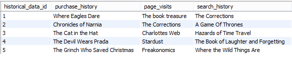
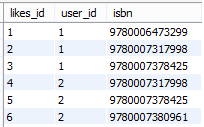
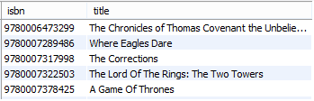
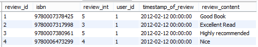
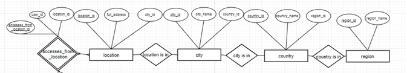
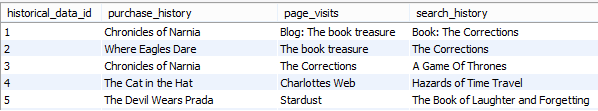

## Project: Database Design to support Library and its Recommendation Engine

##

**        Mohammad Farhan Pasha**

**18200409**

**                              mohammad.farhanpasha@ucdconnect.ie**

**Table of Contents**

**1.**     Introduction 4
 1.1 Vision 4
 1.2 Background Knowledge 5
 1.3 The need for database solution for recommender system 5
 1.4 The nature of data 5
 1.5 Proposed Solution 6

**2.**     Database Plan: A Schematic View 6

**3.**     Database Plan: A Normalized View 8
  3.1 Description and Role of each Table 8
  3.2 Normalization Level Attained 14

**4.**     Database Views 17

4.1 Page Visited View
 4.2 Pearson Correlation Coefficient for Calculating Similarity 18

**5.**     Procedural Elements 20

**6.**     Example Queries: Database in Action 22

6.1 Trustworthiness of the User 22
6.2 Likings of the User 23
6.3 Location 24
   6.3.1 Location of a user 24
   6.3.2 Close Proximity users 25
6.4 Access time of the user 25

**7.    ** Conclusion 26

**8.**     References 29

**List of Figures**

**Figure 2.1:** Entity Relational Diagram 7
**Figure 2.2:** Relational Model Diagram for Location 8
**Figure 3.1:** Sample data from users table 9
**Figure 3.2:** Sample data from access\_time table 11
**Figure 3.3:** Sample data from historical\_data table  11
**Figure 3.4:** Sample data from likes table  12
**Figure 3.5:** Sample data from titles table 12
**Figure 3.6:** Sample data from review table  13
**Figure 3.7:** Sample data from review\_rating table 13
**Figure 3.8:** Conceptual Relational Entity Diagram  14
**Figure 3.9:** Part of ER diagram for Review.  16
**Figure 3.10:** Part of ER diagram for Location  17
**Figure 4.1:** View V\_page\_visited 18
**Figure 4.2** View V\_Corelation. 19
**Figure 5.1:** Procedural Elements used to create view suggesstion\_books 20
**Figure 5.2:** Table to display Top Suggestions after calculating Correlation. 21
**Figure 5.3:** Book Recommendation in action. 21
**Figure 5.4:** Trigger for age 22
**Figure 6.1:** Query for calculating trustworthiness of the user. 23
**Figure 6.2:** Query for viewing likings of a user. 24
**Figure 6.3:** Query for displaying location of the user on different
.                    hierarchy level 24
**Figure 6.4:** Query for displaying users accessing from close proximity. 25
**Figure 6.5:** Query for displaying average access duration of users. 26

**1. Introduction**

A database is a structured collection of records of data. These records saved can be queried in many ways to retrieve the required information from the database. In relational database model the data are stored in logical, well-defined relationships in the form of tables.  Each table has a unique primary key which help in identifying the information.

Some of the advantages of Relational Database as seen in [1] are:

Support to Operations based on set theory:
Relational databases supports mathematical set operations such as projection, selection, union, intersection and Cartesian which performs best when the database is in normalized form.
Accurate: Records are stored just once which gets rid of data duplication problem and ensured data integrity.
Flexibility: Complex operations can be performed using a set of relatively simpler queries.
Trusted: Relational database are the most common and widely used database system which are mature and easily-understood.
Collaboration: Multiple applications, APIs and users can access the same database at the same
time.
Dynamic Views: A view is basically a table which is not part of the schema but can be a part of a table or joined result from multiple table which helps in hiding the complexity of the data.
Secure: Limited access and need for permission for database usage provides excellent security
by the means of privileges.

1.
  1. 1 **Vision**

This Project is about creating a database architecture which will help the library system to hand
pick books for particular user based on his previous and current actions. Our motive here is to create the backbone of the recommender system by implementing normalized relational tables containing all the information required by the recommender system. The SQL queries included in the report to create, insert, update and demonstrate the working of the system is attached as a separate single file with this report. Apart from using normalized tables we will create dynamic views and procedural elements which will be discussed in following sections.

1.
  1. 2 **Background knowledge**

Recommendation system are of three types:

1. Collaborative Based – In this type of recommender system the previous historical data such as likes/dislikes, ratings, interests are taken into account of the user who&#39;s characteristics match the properties of current user as seen in [2].
2. Content Based – In Content based recommender system, the description of the item are taken into account such as type of item, category of item, usage of item etc.
3. Hybrid – In this, both collaborative and content based recommender models are taken into consideration.

In this project, we will be creating the database architecture based on the hybrid recommender system model where we will be maintaining the historical data of the users to track their likes, dislikes, location of access on different tiers (for example city-wise, country-wise and region-wise), purchase history, page visited and search history. As well as data regarding the product (book) which will be authors, themes and qualities.

1.
  1. 3 **The need for database solution for recommender system**

By providing customized books suggestions, this system will help users to handle the information overload problem. The recommendation of items are considered to be demanding as it is based on many factors such as popularity of the book, the book reader&#39;s interest, short-term reading interests etc. This system will help application to bring and retain user traffic.

1.
  1. 4 **The nature of data**

The data which we will be dealing with includes data coming from users in the form of likes, review, review ratings, trustworthiness of the user. Also data from books such as authors, themes and authors.

1.
  1. 5 **Proposed solution**

- Database design which will help in recommendation system by taking the advantage of minimal query time required by a normalized database.
- Risk Aware Recommendation: Timestamps of logins will be maintained as recommendation should also focus on the time when user accesses the system. The recommendation during office hours of the user should be different from the recommendation from free time.
- Provide views to the database for adding security and for generating reports.
- Use of procedural elements to support recommendation system.
- Sample queries to return real and demonstrative results.

**2. Database Plan: A Schematic View**

Entity Relationship Diagram represents the diagrammatic flow of data and information. It gives the appropriate knowledge of the underlying relationships between tables. The conceptual database plan is showed using ER diagram in figure 2.1 where the application domain as recommender system has been strictly considered.

 

**Figure 2.1:** Entity Relational Diagram

Why there are so many tables related to location?

Due to the importance of geographical location of the user in recommendation system it is essential to store information at different levels so that during a book suggestion we can look at the list of trending book in a particular city, country and regional hierarchy. 

Another main reason that there are multiple tables based on same entity was to make these table in BCNF form, as city+country-\&gt; region OR city-\&gt;region OR city-\&gt;country OR country-\&gt;region. To avoid these dependencies we need to create multiple independent tables. After applying the relations seen in the figure 2.2, we can easily derive the region from city or from country.

**3 Database Plan: A Normalized View**

**3.1 Description and Role of each Table**

3.1.1 Users Table

Users table has various attributes where primary key is user\_id and other attributes are .        first\_name        –         Storing First name of the user.
.        last\_name         –    Storing Last name of the user.
.        date\_of\_birth   –          Storing Date of birth of the user.
.        facebook\_id      –          Storing the Social Media id which will be useful to extract the                        .                                          interests/likes of the users.
.        location\_id        –        Which stores the location\_id of the user.
.        age                     –   It denotes age of the user.
.        gender                      –   Gender to differentiate user&#39;s personality and likings.

Users table has a relationship with the location table having a weak entity in between as
accesses\_from\_location to ensure many to many relationship in a normalized fashion.

 

3.1.2 accesses\_from\_location Table

In this table, the primary keys of users and location are saved to maintain many to many relationship keeping in mind the fact that many users can access from multiple locations. .        accesses\_from\_location        –         Primary key
.        users\_id                        –            Storing user\_id
.        location\_id                –          Storing location\_id

3.1.3 location Table

        Instead of only storing a string of address, we can maintain a separate table for location. As recommendation depends on geographical data, a user should be recommended a book which is trending (as seen in [3]) in the region he is accessing the application from. In this table, the full address is stored as a large string, also city\_id is stored so that we can derive city country and region while we are working on recommendation.
.        location\_id                –         Primary key
.        full\_address                –            Storing full address
.        city\_id                        –          Used to access city name and country where the city is.

3.1.4 City Table

        The city table stores the city name and country id corresponding to them. To recommend users the book which is trending on the city level.

city\_id                                –         Primary key
city\_name                        –            Name of the city
country\_id                        –          Used to access country name and region where the . ,                                        country is.

3.1.5 Country Table

        The country table stores the country name and region id corresponding to them. To recommend users the book which is trending on the country level.
.        country\_id                        –         Primary key
.        country\_name                        –            Name of the country
.        region\_id                        –          Used to access region.

3.1.6 Region Table

The region table stores the region name. To recommend users the book which is trending on the region level.

region\_id                        –         Primary key
region\_name                        –            Name of the region.

3.1.7 has\_account\_access\_time

        This table maintains the many to many relationship between users and access time. It maintains access\_time corresponding to the individual users. Many users can have multiple access\_time, also one user can have multiple access time which will be taken care by this table.

accesses\_from\_location        –         Primary key
users\_id                        –            Storing user\_id
access\_id                        –          Storing access\_id

3.1.8 access\_time

        This table has the user&#39;s access time and exact access time stamp which will be used by the recommendation engine to customize the recommendation process based on the time of usage and duration of usage.

accesses\_id                        –         Primary key
access\_timestamp                –            Stores login timestamp.
Access\_duration                 –            Stores the amount of duration spent by the user.
 

3.1.9 has\_historical\_data
.        Instead of creating attributes in user table, we created a new table to store multiple historical data. This table maintains relationship between users table and historical data\_table.

3.1.10 historical\_data

        This table maintains the purchase history of the user, page visits ad search history.
 

3.1.11 likes

        Users likes book/books which is mapped using the weak entity relationship table &#39;likes&#39; storing user\_id and isbn of the book.
 

From the above data snippet we can say that user with user\_id 1 and 2 likes 3 books each.

3.1.12 titles

        The two attributes for this table are the book title and ISBN of the book. This entity has many related entities such as authors qualities and themes which is used in Content-Based Recommender System.

 

3.1.13 authors

        This table has a composite key comprising isbn and rank so that books having multiple authors doesn&#39;t have rows with same primary key thus maintaining 1NF rule.

3.1.14 qualities

        One book can have multiple qualities which is taken care by creating composite keys with isbn and rank.

3.1.15 themes

        In Content based recommender system we may require themes to designate book a category, which is used by recommender system to suggest books similar to books having similar themes .

3.1.16 review

        A book can get reviewed by the users. Reviews are good way to differentiate between two candidate books which are ready to be suggested to users. The table saves the user\_id and review\_id as well as may other attributes as explained below:
.                 review\_id                -         Primary key
.                user\_id                -         Id of the user who reviewed that book
.                isbn                        -        The book which got reviewed
.                review\_content        -        The comments given by user.
.                review\_int                -        Numerical rating on the book. (Out of 5)
.                timestamp\_of\_review -        The time when review was made.

 

3.1.17 review\_gets\_rated

        Many review can get rated by multiple users hence a weak entity relationship has been established which saves the primary keys of review table and review\_rating table **.**

3.1.18 review\_rating

        The review gets a rating which will be useful to calculate the trustworthiness of the user, which is nothing but the average of the review ratings he got for his reviews. The more trustworthy the user the better recommendation he can give.
.                review\_rating\_id        -        Primary key
.                review\_rating\_int        -        Ratings given to that review (Out of 5)

  

**3.2 Normalization Level attained:**
 

**Figure 3.8:** Conceptual Relational Entity Diagram

**1**** st **** Normal Form (1NF)**

Rule 1: Single Value Attribute

This rule states that no tuple should have more than 1 value.

Rule 2: Attribute Domain should not change

        Every attribute should have same datatype.

Rule 3: Unique names for Attributes/Columns

        Every column name should have a distinct name.

Rule 4: Ordering of rows doesn&#39;t matter,

        Orders of tuples can be arbitrary.

Query: select \* from review
Output:
 

All of the tables are in 1NF normalization form as it satisfies all the rules required to be in 1NF. For example the above snippetshows the table review is in 1NF normalization form.

**2**** nd **** Normal Form (2NF)**

Rule 1:

Relations should satisfy all the rules stated in 1NF.

Rule 2:

There should be no partial dependencies in the tables.
A **Partial Dependency** is a state where an attribute in the table only depends on the part of primary key and not the whole key.
In our databse design we removed all the partial dependencies in the table.

For example, earlier design consisted review and it&#39;s rating in the same table which was violating both 2NF and 3NF. But after separating it into two tables with a weak entity table in between, review and review\_rating got normalized with 2NF. 

**3**** rd **** Normal Form (3NF)**

Rule 1:

Relations should satisfy all the rules stated in 1NF and 2NF both.

Rule 2:

        There should be no transitive dependencies in the table. A Transitive dependency occurs when a non-prime column depends on another non-prime column instead of solely depending on primary key. While designing the database model all transitive dependencies were removed making all the tables in 3NF form.

**BOYCE CODD Normal Form (BCNF)** Rule 1:

Relations should satisfy all the rules stated in 1NF, 2NF and 3NF.

Rule 2:

There should be no nontrivial functional dependency P-\&gt;Q, when P is non super-key.
In our database design, the only table to violate BCNF was &#39;Location table&#39; as we can easily derive country if we know city. Also, the combination of city and country can help us derive region (A+B-\&gt;C). As city, country or region were non-super keys, they were violating BCNF.

Solution: We decomposed tables in such a way that we can get rid of the above dependencies.
 

        **Figure 3.10:** Part of ER diagram for Location

  **4. Database Views:**

Database views are used to show the information on a different point of view. If the database table value changes the same reflections can be seen on the views. We can get result of some very complex queries without affecting the original table, which makes original table safe from illegal manipulations.

We can use database view for 2 reasons:
1. Security. Avoid giving access to original tables by creating views using subset of the table.
2. Reports. We can generate dynamic reports using views.

In our database model, we have used views for both the purpose:
1. Page Visited View.
2. Pearson Correlation Coefficient for calculating similarity

**4.1 Page Visited View.**

This view creates a report of users and the pages visited by them. This view can be used by recommender engine as it is solely based on the historical visit pattern of the user. 

The result of the view:

 

Also it hides various other critical information present in the historical\_data table, hence making it quite secure. In the figure, we can see that columns such as purchase\_history and search\_history gets hidden from the accessors or recommendation engine itself if it doesn&#39;t require that information at that point of time
 

**4.2 Pearson Correlation Coefficient for calculating similarity**

Recommendation system require similarity matrix to calculate resemblance among users when dealing with collaborating recommendation approach. We will be applying Correlation on the reviews (numerical 1-5) give to books by the users. If two users are correlated to each other, then the likelihood that user 2 will like the books liked by user 1 is more than with unrelated users as seen in [4] and [5]. This view will create all the necessary attributes desired when calculating the Pearson Correlation coefficient.

The formula for Pearson Correlation coefficient is given by:

r = (

In our case it will be

r = (

 
**Figure 4.2** View V\_Corelation.

Output:  select \* from V\_corelation;

 

We will be using some Procedural Elements to recommend books to specific users using the above view in later sections.
In the above snippet for V\_corelation, the minimum amount of threshold we have used is 2. 2 is very small when compared to actual recommendation system, but due to the limited amount of rows in table we have kept low threshold.

**5. Procedural Elements:**

In our database design model we have considered some PL/SQL aspects while recommending books to the user based on the reviews given by them. We will be using the view created in the above section while calculating the correlation between the users. The higher the correlation between the book the more closely they are related and higher the chances of getting recommended.

Here we will be calculating correlations for each pair of book which are reviewed.

 

Output : select \* from suggestion\_books;
 
The above table can be modified using Procedural Elements to provide use with recommendation order. For example which top 5 books to recommend if user likes the book with ISBN 9780006473299?

The modified code with max 5 recommendation:   

Output : Select \* from top\_suggessions;

 

In the above output snippet we can easily interpret that if the user likes book with isbn 9780006473299 then the very first book to be recommended to him should be the book with ISBN
9780007317998. Books with ISBN 9780007380961 and 978000737425 as second and third suggestion.

We also used a basic trigger to check if the age of the user is within a proper range or not. If we found a negetive age being entered, then the value of age is set to 0.

 

 

Output: select \* from users;

 

We have tried avoiding the usage of complex triggers in our design due to following reasons:

- Triggers are Global – Triggers fails to see the context of the query. Therefore they get triggered everytime when the condition gets satisfied.
- Triggers are Stealthy – We can easily forget the existence of triggers until they affect our query results in malicious way.

**6. Example Queries: Database in Action.**

**6.1 Trustworthiness of the User:**

In recommendation system, to avoid various conflicts such as which user to select as a candidate user while we suggest a book is crucial as seen in [6] and [7]. User1 could have same taste as User2 and User3, but when we ran our recommendation engine User 2 said that book1 should be suggested while User2 said that book2 should be recommended. So which one to select book1 or book2? We can decide by setting a trustworthiness factor associated with every user.

Table &quot;review\_rating&quot; maintains the ratings given to the review of a book by the each user. By using the query below we can calculate the average rating given by other users to the reviews of that user. By doing this, we can calculate trustworthiness, as greater the average of the review ratings, greater the influence of the user.

 
 

In the above case, if USER1 and USER3 are candidates, then looking at the trustworthiness of the users we can now easily select USER3 as our candidate.
Calculations: User3 had 3 reviews which were rated and the rating given was 4,4 and 3. So, the trustworthiness factor turns out to be 3.666.

**6.2 Likings of the user.**

The below query will help the recommender system to gather the information of the user&#39;s liking pattern which help in customizing the suggestions.

The below query can be used to see the books liked by a particular user.

 

Output:

 

In the above result we can see that USER1 likes 3 books. Our Recommendation system can use this data to predict the book which will be liked by USER1.

**6.3 Location.**

**6.3.1 Location of a user.**

A personalized suggestions are based on the information of the user such as age, geographical location and gender. In our database design schema our model is normalized in such a way that we can view the location of the user in a hierarchical way. This hierarchy is useful when recommending items to users, as recommendation depends on the current trends of a particular city, country or region. By applying self joins on user and location tables we can jump from and onto different hierarchy levels of geographical locations needed for recommendation purpose. The following query shows a number of self joins applied for accessing location for a particular user in the database.

 

Output:

 
**6.3.2 Close Proximity users.**

We can also look for the users that are in the close proximity to each other to see their likings and interest as well as suggests the same books by taking reference from close proximity users. The query below shows the users who accessed the library from the same city as USER1:

 

 

In the above results we can see that USER3 and USER4 accessed the library from the same city as USER1.

**6.4 Access time of the user.**

The Access time and duration denotes the actual usage of the user, the recommendation system requires this information in order to calculate the list of suggestions to be made to the user. Some user may have short usage duration, such users should be recommended the books which are short in lengths while users with long usage durations should be suggested long novels. The query below provide the access duration in hours for the users:
 

Output:
 

**7. Conclusions**

While designing the database, I came to a fine understanding about &#39; **How To Design A Good Database**&#39; which are outlined below:

The very first step includes deciding the motive of your database. Where the database will be used? How frequently it will be used.

Second step includes finding and organizing the information required by the system for which you are designing your database. For example, in our case, it was access time, historical data, reviews, rating of review etc.

Third step involves grouping these information into groups which will become our tables in the database. Further it involves breaking those groups into items which will become our attributes.

Step four includes specification of primary keys which are used to identify tuples in the table, Specification of relations between the tables and specification of constraints in tables.

Step five will be to regularly check the integrity of the table as well as accuracy of the information.

In Step six we need to analyze the role of all entities and relations between them.

Step seven is to make all the table normalized so that the information retrieval process gets speed up and thus avoiding repetition of work.

**Salient features of our design:**

Our design provides **integrity to the data** , which makes the whole system reliable. By **preprocessing** the data in the database model itself provides **less redundant data** , which means that recommendation engine can focus on the recommendation part rather than preprocessing the data first and the performing operations on them. **Normalization** leads to data being **consistent** and **non-redundant.** As seen in [8] Normalization leads to **smaller size tables** which are easier to handle and understand. Moreover, the **anomalies that occur during insertion, updating and deletion gets reduced** drastically with a good database design. The duplication of data problem doesn&#39;t exists.

**How the work we performed here is going to help while working with recommendation engine?**

Our database design provides information to recommendation engine in a very organized manner with no redundancy and inconsistency. The information is segregated in the database level itself which makes recommendation system to focus more on suggestion part rather than preprocessing of data. We created views to report the Co-Relation between different books which will be used by recommendation engine to calculate the association between two books. We implemented a small book recommendation system on the database level to create recommendation based on reviews by the user. This implementation could be used as a building block to create a large recommendation system which not only focusses on review but also on some historical data, current trends pattern, location of the user, access time and categories of books. We calculated the &#39;trustworthiness&#39; of the user based on the ratings of his reviews which will be used by our recommender engine to rank users while performing collaboration based recommendation.

**Limitations:**

As the amount of data we are currently dealing with is very less we may need more data in order to make comments on efficiency of our design. On performing normalization, we get advantage of redundancy, consistency and less duplication of data, but efficiency gets reduced as smaller table needs to be joined first even if we perform simpler queries.

**REFRENCES:**

[1] StuDocU (2017), &quot;Design Concept&quot; and &quot;Advance design and Implementation&quot;, in Database Systems 12e: Design Implementation and Management by Carlos Corolnel and  Steven Morris [https://www.studocu.com/en/book/database-systems-design-implementation-and-management/carlos-coronel-steven-morris/7265](https://www.studocu.com/en/book/database-systems-design-implementation-and-management/carlos-coronel-steven-morris/7265).

[2] IEEE (2013) , &quot;Collaborative filtering recommendation based on User Personality&quot;, IEEE  Conferences on Information Management, Innovation management and Industrial engineering, by Zhichao Quan.
[https://ieeexplore.ieee.org/document/6703579](https://ieeexplore.ieee.org/document/6703579)

[3]  IEEE (2015) , &quot;Trends, problems and Solutions&quot;, IEEE Conferences on Computing, Communication and Automation, by Sarika Jain, Anjali Grover, Praveen Singh Thakur and Sourabh Kumar Choudhary.

[https://ieeexplore.ieee.org/document/7148534](https://ieeexplore.ieee.org/document/7148534)

[4] Towards Data Science (2018), &quot;Collaborative Filtering Based Recommendation System Examplified..&quot; by Chhavi Saluja.
[https://towardsdatascience.com/collaborative-filtering-based-recommendation-systems-exemplified-ecbffe1c20b1](https://towardsdatascience.com/collaborative-filtering-based-recommendation-systems-exemplified-ecbffe1c20b1)

[5] Thomson Rueter Endote (2016) &quot;An Implementation of Pearson Correlation Method for predicting items to user in E-Commerce&quot; by Arjun Singh Tomar, Amit Shrivastava and Shishir Kumar, Department of Computer Science and Engineering Jaypee University of Engineering  and Technology.
[https://zenodo.org/record/57944/files/103.pdf](https://zenodo.org/record/57944/files/103.pdf)

[6] The 14

# th
 International Conference ,ACM &quot;Trust and Trustworthiness in Social Recommender System.&quot; by Taha Hasan and D. Scott McCrickard, Computer Science Department, Virginia Tech, Blackburg, VA.
[https://arxiv.org/pdf/1903.01780.pdf](https://arxiv.org/pdf/1903.01780.pdf)

[7] Semantic Scholars (2013), &quot;A Social Influence based Trust Model for Recommender System&quot;, by Jian Ping Mei, Han Yu, Zhiqi Shen and Chunyan Miao.
[https://pdfs.semanticscholar.org/08b7/7ebe2b65b9faf66f7dafc428e05a03778d36.pdf](https://pdfs.semanticscholar.org/08b7/7ebe2b65b9faf66f7dafc428e05a03778d36.pdf)

[8] O&#39;Reilly , &quot;Normalization and DeNormalization &quot; in &quot;Optimization Schema and Datatypes&quot;, in High Performance MySql 3

# rd
 Edition by Baron Schwartz, Peter Zaitsev and Vadim Tkachenko.
[https://www.oreilly.com/library/view/high-performance-mysql/9781449332471/ch04.html](https://www.oreilly.com/library/view/high-performance-mysql/9781449332471/ch04.html)

** **
